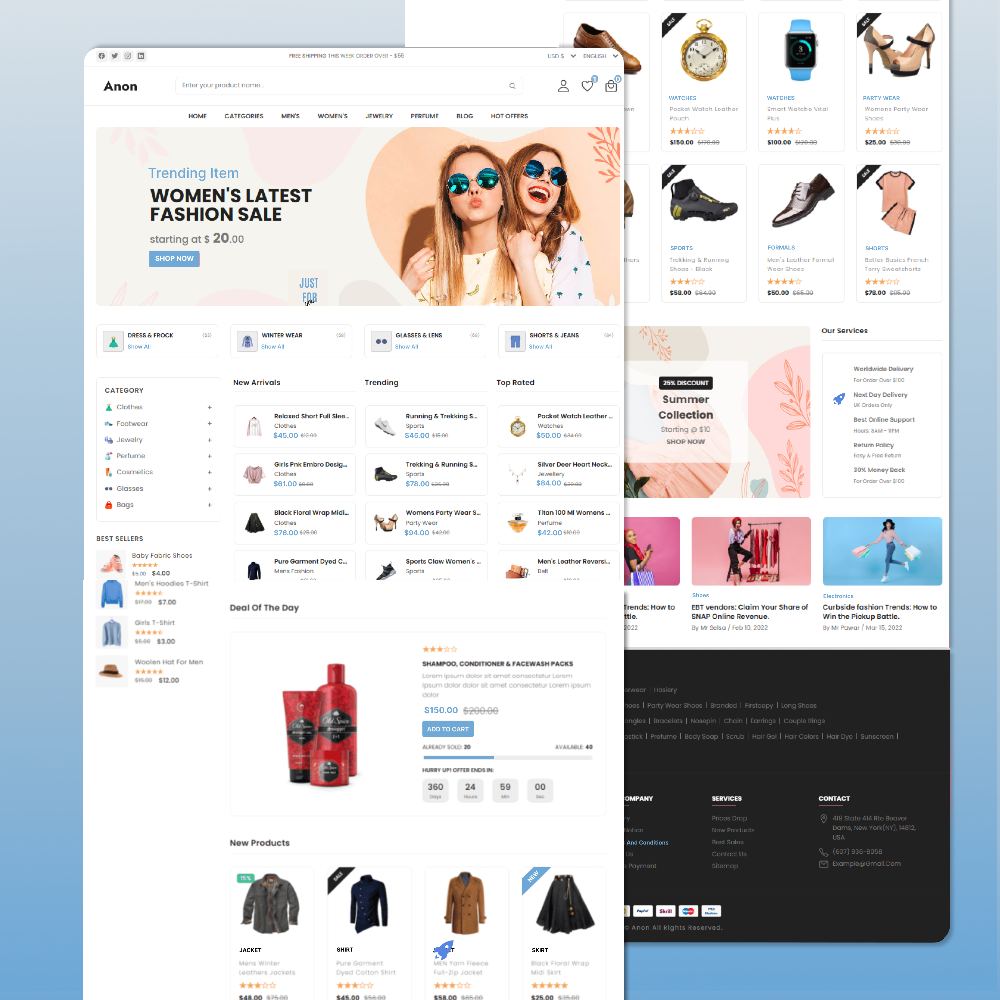

# Anon - An eCommerce Website

Anon is a fully responsive eCommerce website, maximum compatibilities in all mobile devices, built using HTML, CSS, and JavaScript.

[Learn to Create Responsive Ecommerce Website from Scratch.](https://www.sevensquaretech.com/responsive-ecommerce-website-from-scratch-with-html-css-js/)

## Demo




## Prerequisites

Before you begin, ensure you have met the following requirements:

- [Git](https://git-scm.com/downloads "Download Git") must be installed on your operating system.

## Installing Anon

To install **Anon**, follow these steps:

Linux and macOS:

```bash
sudo git clone https://github.com/SevenSquare-Tech/responsive-ecommerce-website.git
```

Windows:

```bash
git clone https://github.com/SevenSquare-Tech/responsive-ecommerce-website.git
```

## License

This project is **free to use** and does not contains any license.
